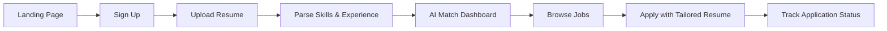
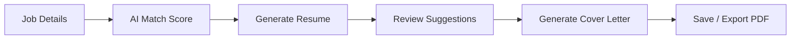
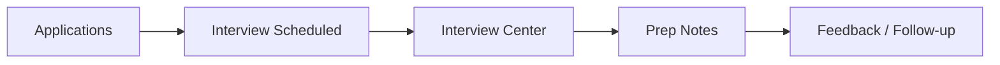

# AI Job Application Platform — Product Design Specification

This document translates the brief in the attached instruction file into a modern SaaS design blueprint for an AI-powered job application platform. It is intentionally design-only and does not include implementation code.

---

## 1. Product Vision

A focused, high-productivity workspace where job seekers can:
- Upload and parse resumes
- Discover relevant roles
- Receive AI match scoring
- Generate tailored resumes and cover letters
- Track applications and interview progress

The product should feel like a blend of Linear, Notion, Stripe Dashboard, and Vercel Dashboard: calm, structured, fast, and confidence-building.

---

## 2. Product Sitemap

```text
Home
├── Landing / Marketing
├── Sign In
├── Sign Up
└── Pricing / FAQ

App
├── Dashboard
│   ├── Overview
│   ├── Match Score Summary
│   ├── Recent Applications
│   └── Upcoming Interviews
├── Jobs
│   ├── Discover Jobs
│   ├── Saved Jobs
│   └── Job Details
├── Resume Hub
│   ├── Resume Upload
│   ├── Skill Extraction
│   ├── Resume Generator
│   └── Resume Versions
├── Cover Letters
│   ├── Generate Cover Letter
│   └── Saved Templates
├── Applications
│   ├── Active Applications
│   ├── Archived Applications
│   └── Application Timeline
├── Interview Center
│   ├── Interview Calendar
│   ├── Interview Prep
│   └── Notes & Feedback
├── Insights
│   ├── AI Match Trends
│   ├── Skill Gap Analysis
│   └── Recommendations
└── Settings
    ├── Profile
    ├── Resume Preferences
    ├── Notifications
    └── Billing
```

---

## 3. Core User Flows

### A. First-time resume upload to first application



### B. Generate tailored resume and cover letter



### C. Interview tracking and preparation



---

## 4. Main Navigation Structure

### Primary navigation
- Dashboard
- Jobs
- Resume Hub
- Applications
- Interview Center
- Insights
- Settings

### Secondary navigation
- Discover Jobs
- Saved Jobs
- Match Scores
- Resume Generator
- Cover Letters
- Activity Timeline
- Billing & Plans

### Navigation behavior
- Persistent left sidebar on desktop
- Collapsible mobile bottom nav
- Contextual quick actions in top-right
- Breadcrumbs in deeper pages

---

## 5. Dashboard Layout

### Desktop dashboard composition
1. Header
   - Product name / workspace switcher
   - Search jobs and resumes
   - Notifications
   - User avatar
2. Hero summary panel
   - Match score trend
   - Applications this week
   - Resume quality score
3. Primary content grid
   - Recommended jobs
   - Recent applications
   - Interview pipeline
   - Skill growth insights
4. Right-side insight rail
   - AI recommendations
   - Upcoming interviews
   - Resume improvement tips

### Dashboard feel
- Spacious whitespace
- Soft neutral surfaces
- Minimal but expressive cards
- Clear hierarchy with subtle depth

---

## 6. Mobile Layout

### Mobile first principles
- Single-column layout
- Bottom navigation for key destinations
- Swipe-friendly cards
- Sticky top bar for search and actions
- Sheet-based modals for forms and filters

### Mobile structure
- Home / Dashboard
- Jobs
- Applications
- Resume
- Profile

### Mobile interaction model
- Quick actions via floating action button (FAB)
- Filter chips instead of large sidebars
- Progress-based status on application cards

---

## 7. Information Architecture

### Content organization principles
- User goals drive top-level grouping
- Actions are near the context they affect
- Progress and status are always visible
- AI outputs are presented as assistive, editable artifacts

### IA hierarchy
- Discover → Act → Track → Improve
  - Discover jobs and opportunities
  - Act with resume and cover-letter generation
  - Track applications and interviews
  - Improve via insights and recommendations

---

## 8. Design System

### Visual language
- Palette: soft slate, white, emerald accents, electric blue highlights
- Typography: Inter or SF Pro for clarity and speed
- Radius: 12–18px for cards, 999px for pills
- Spacing: 8px system with generous whitespace
- Elevation: subtle shadows, no heavy glassmorphism

### Tone and motion
- Calm, confident, intelligent
- Micro-interactions: smooth hover, subtle expand, soft fade-in
- Motion should be brief and purposeful

### Core design tokens
- Background: #0B1020 / #0F172A
- Surface: #111827 / #151C2D
- Surface-muted: #1F2937
- Border: #2A3346
- Text: #E5EEF8
- Muted text: #A6B3C4
- Accent: #3B82F6
- Success: #22C55E
- Warning: #F59E0B

---

## 9. Component Library

### Layout components
- App shell
- Sidebar
- Top navigation bar
- Page header
- Section container
- Card grid
- Empty-state panel

### Data components
- KPI stat card
- Match score badge
- Progress bar
- Job listing card
- Application status chip
- Interview timeline card

### Input and action components
- Search input
- Filter chips
- Toggle switch
- Dropdown menu
- Primary and secondary buttons
- CTA card
- File uploader

### AI output components
- Resume summary panel
- Skill extraction chips
- Cover letter composer
- Match reason breakdown
- Recommendation list

### Feedback components
- Toast notifications
- Inline success banner
- Loading skeletons
- Error callout

---

## 10. Page-by-Page Design Details

### Page 1: Dashboard
- Purpose: Give the user a fast overview of progress, matches, and next actions.
- UI sections:
  - Header and search
  - KPI cards
  - Recommended jobs
  - Recent applications
  - Upcoming interviews
  - Insight panel
- Components required:
  - Stat cards, job cards, timeline, progress bars, charts
- User actions:
  - Search jobs, open job details, review recommendations
- Empty states:
  - No applications yet
  - No jobs matched yet
- Loading states:
  - KPI skeletons
  - Card shimmer for job feed

### Page 2: Jobs Discover
- Purpose: Help users find relevant opportunities quickly.
- UI sections:
  - Filters and search
  - Job list
  - Match score summary
  - Saved jobs area
- Components required:
  - Filter drawer, job cards, chips, sorting dropdown
- User actions:
  - Search, filter, save, open detail
- Empty states:
  - No results found
  - No saved jobs yet
- Loading states:
  - Loading job cards
  - Skeleton filter panel

### Page 3: Job Details
- Purpose: Show why a role is a fit and what the user should do next.
- UI sections:
  - Role summary
  - Match explanation
  - Required skills
  - AI-generated resume suggestions
  - Apply CTA
- Components required:
  - Detail header, tags, score meter, bullet list, CTA block
- User actions:
  - Apply, save, generate resume, generate cover letter
- Empty states:
  - No match explanation available
- Loading states:
  - Rich content skeleton

### Page 4: Resume Hub
- Purpose: Centralize uploaded resumes, skill parsing, and versions.
- UI sections:
  - Resume upload area
  - Parsed skill overview
  - Experience timeline
  - Resume versions
- Components required:
  - File uploader, chips, summary cards, version list
- User actions:
  - Upload, parse, edit, export, create new version
- Empty states:
  - No resume uploaded yet
- Loading states:
  - Parsing progress and resume preview skeleton

### Page 5: Resume Generator
- Purpose: Create tailored resumes for jobs.
- UI sections:
  - Job context panel
  - Suggested edits
  - Resume draft preview
  - Export actions
- Components required:
  - Editor panel, AI suggestion cards, export buttons
- User actions:
  - Generate, review, edit, save to version history
- Empty states:
  - No job selected for tailoring
- Loading states:
  - Draft generation progress bar

### Page 6: Cover Letter Generator
- Purpose: Produce personalized cover letters from role and resume context.
- UI sections:
  - Prompt inputs
  - Draft output viewer
  - Tone selector
  - Save/export actions
- Components required:
  - Tone pills, text editor, buttons, templates
- User actions:
  - Generate, edit, copy, save
- Empty states:
  - No template selected
- Loading states:
  - Cover letter loading placeholder

### Page 7: Applications Tracker
- Purpose: Help users monitor where each application stands.
- UI sections:
  - Status filters
  - Application cards
  - Timeline view
  - Follow-up reminders
- Components required:
  - Status chips, table/cards, timeline, timeline filters
- User actions:
  - Update stage, add note, archive, view details
- Empty states:
  - No applications tracked yet
- Loading states:
  - List shimmer, pending status update skeleton

### Page 8: Interview Center
- Purpose: Prepare for and track interview progress.
- UI sections:
  - Calendar overview
  - Upcoming interviews
  - Prep checklist
  - Notes and feedback area
- Components required:
  - Calendar widget, checklist, notes card, timeline
- User actions:
  - View schedule, add notes, mark prep complete
- Empty states:
  - No interviews scheduled
- Loading states:
  - Calendar skeleton and notes loader

### Page 9: Insights
- Purpose: Show trends, match performance, and skill gaps.
- UI sections:
  - Match score trend chart
  - Skill gap analysis
  - Improvement suggestions
  - AI recommendation feed
- Components required:
  - Charts, insight cards, list of actions
- User actions:
  - Review recommendations, explore skill gaps
- Empty states:
  - Insufficient activity yet for insight generation
- Loading states:
  - Chart skeletons and insight loading panels

### Page 10: Settings
- Purpose: Manage profile, preferences, billing, and notifications.
- UI sections:
  - Profile summary
  - Preferences tabs
  - Billing status
  - Notification controls
- Components required:
  - Form sections, segmented controls, toggles, billing cards
- User actions:
  - Update profile, manage notifications, change plan
- Empty states:
  - No billing history yet
- Loading states:
  - Settings form skeletons

---

## 11. ASCII Wireframes

### Dashboard
+---------------------------------------------------------------+
| Logo | Search Jobs        | Notifications | Profile           |
+-------------------------+-------------------------------------+
| Nav: Dashboard | Jobs | Resume | Applications | Settings      |
+-------------------------+-------------------------------------+
| KPI Cards: Match 84 | Applied 12 | Interviews 3 | Resume 92% |
| Recommended Jobs        | Recent Applications                 |
| [Role Card] [Role Card]| [App Card] [App Card]             |
| Upcoming Interviews     | AI Recommendations                 |
| [Calendar] [Tips]       | [Insight Board]                    |
+---------------------------------------------------------------+

### Job Search
+---------------------------------------------------------------+
| Jobs / Search                                                  |
| [Search] [Location] [Level] [Remote] [Apply Filters]         |
+---------------------------------------------------------------+
| Results: 128 jobs                                             |
| [Job Card] Match 92% | [Job Card] Match 88%                   |
| [Job Card] Match 81% | [Job Card] Match 76%                   |
| Saved Jobs | Trending Skills | Popular Roles                  |
+---------------------------------------------------------------+

### Job Details
+---------------------------------------------------------------+
| Back | Save | Apply                                           |
| Senior Product Engineer                                       |
| Company • Location • Remote • Full-time                       |
| Match Score 91% | AI Summary                                  |
+---------------------------------------------------------------+
| Why this role fits                                           |
| - Strong skills match                                         |
| - Relevant experience                                         |
| - Good remote flexibility                                     |
+---------------------------------------------------------------+
| Required Skills: React, TypeScript, System Design             |
| Resume Suggestions: Tailor summary / Add metrics              |
| Generate Resume | Generate Cover Letter                       |
+---------------------------------------------------------------+

### Resume Studio
+---------------------------------------------------------------+
| Resume Studio                                                 |
| Upload Resume | Use Existing Resume | Generate New Version     |
+---------------------------------------------------------------+
| Parsed Skills: React, TS, Python, Product Strategy            |
| Experience Timeline                                           |
| [Role 1] [Role 2] [Role 3]                                    |
| AI Suggestions: Strengthen leadership section                 |
| Preview Pane                                                  |
| [Draft Resume Content]                                        |
+---------------------------------------------------------------+

### Application Tracker
+---------------------------------------------------------------+
| Applications                                                   |
| All | Applied | Interview | Offer | Archived                 |
+---------------------------------------------------------------+
| [App Card] Frontend Engineer | Applied | Due 12 Jun           |
| [App Card] PM Role          | Interview | 15 Jun             |
| [App Card] Data Scientist   | Screening | 18 Jun             |
| Timeline / Next Steps                                         |
| - Resume tailored
| - Cover letter sent
| - Follow-up scheduled                                        |
+---------------------------------------------------------------+

### Settings
+---------------------------------------------------------------+
| Settings                                                       |
| Profile | Preferences | Billing | Notifications              |
+---------------------------------------------------------------+
| Personal Info                                                 |
| Name | Email | Location | Resume Preferences                  |
| Notifications: Email / Push / Weekly Digest                   |
| Billing: Pro Plan | Upgrade / Manage                          |
+---------------------------------------------------------------+

---

## 12. Product Design Principles

1. Reduce cognitive load with clear hierarchy
2. Make AI outputs useful, editable, and trustworthy
3. Keep progress visible at all times
4. Design for fast job-search workflows
5. Keep mobile interactions lightweight and direct

---

## 12. Recommended Next Step

The next step should be a polished Figma wireframe set covering:
- Dashboard
- Jobs discovery flow
- Job detail + AI match explanation
- Resume generation flow
- Applications and interview tracking

This design system is ready to be translated into high-fidelity screens in the next design phase.
